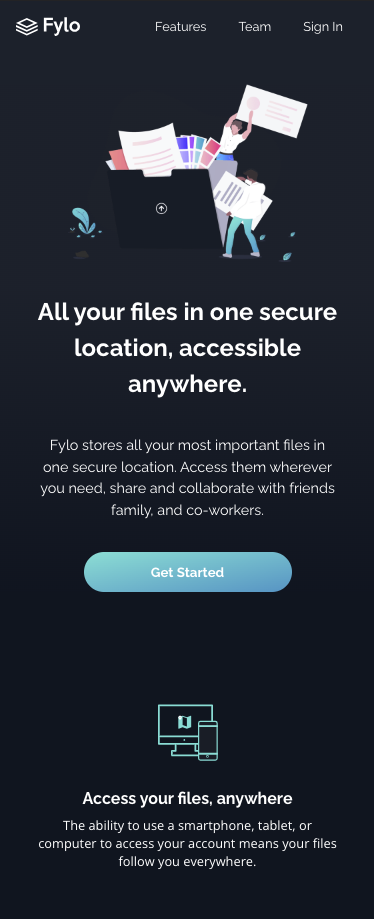
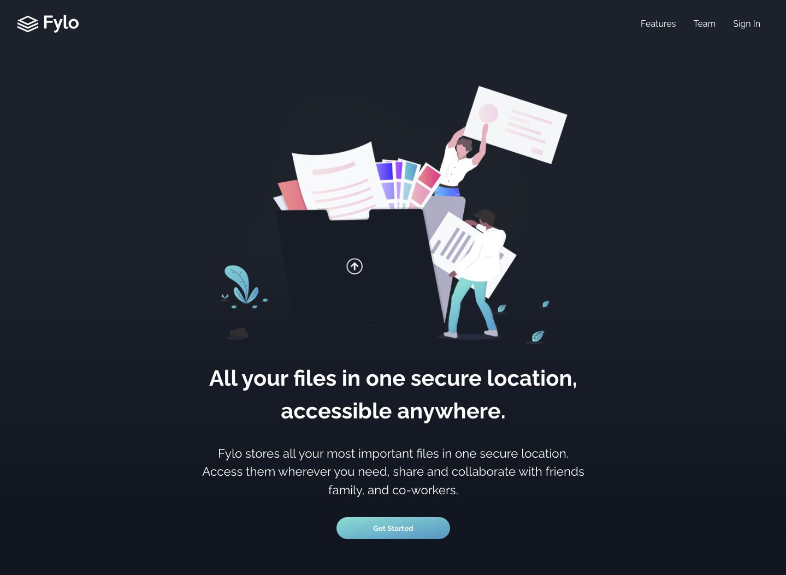

# Frontend Mentor - Fylo dark theme landing page solution

This is a solution to the [Fylo dark theme landing page challenge on Frontend Mentor](https://www.frontendmentor.io/challenges/fylo-dark-theme-landing-page-5ca5f2d21e82137ec91a50fd).

## Overview

### The challenge

Users should be able to:

- View the optimal layout for the site depending on device screen size
- See hover states for all interactive elements on the page

### Screenshots

## My process

### Built with

- Semantic HTML5 markup
- CSS custom properties
- Flexbox
- CSS Grid
- Mobile-first workflow

### What I learned

This project was my first time building a full landing page and I really enjoyed it. Also my first experience building the mobile layout first (375px), then adding the desktop layout at the listed break-point (1440px). There were a few adjusments needed in-between, but the layout responds nicely at all sizes.

### Continued development

I'd like to continuing progressing with more advanced CSS, and get more comfortable with various styles of navigation menus. Collapsing menus, hamburger menus, etc. Thinking more about how to use as few media queries/breaks as possible, and write the most organized / cleanest code possible. Also would like to continue making semantic HTML improvements, and educating myself on accessibility.

### Useful resources

- [CodePen by Barrett Sonntag](https://codepen.io/sosuke/pen/Pjoqqp) -
  This resource helped me add the correct hover color on the social icons, which are PNG'S, using the filter property.

## Author

[Jacob Roberts](https://www.github.com.jacobrobertsdev)
